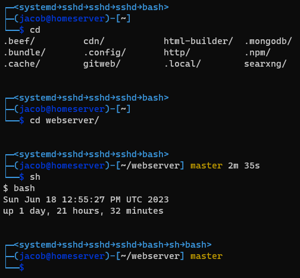

# .bashrc
My server's .bashrc

## PS1

- current shell's process callstack
- user@hostname
- directory
- (optionally) branch of github repo if in one
- time it took to execute last instruction

### Preview

<!--  -->
